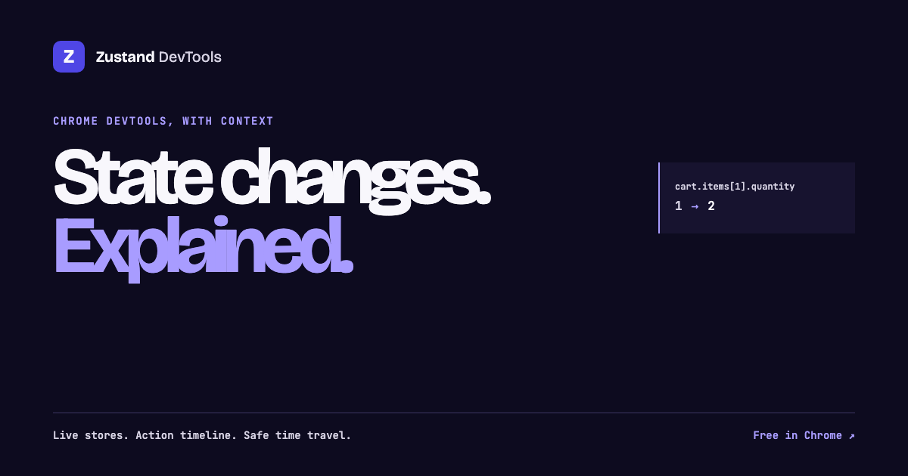

# Zustand DevTools — Trace Sessions

An interactive product site for a Chrome DevTools extension that turns Zustand state changes into inspectable debugging sessions.

[Open the live site](https://smellybricc.github.io/zustand-devtools-site/) ·
[Inspect the extension source](https://github.com/SmellyBricc/zustand-devtools)



## What this site demonstrates

- A complete state-debugging workflow: inspect, record, diff, trace, and share.
- Path-level state changes and likely source call-sites presented as an instrument, not a generic dashboard.
- Clear separation between the free local inspector and the private-beta Trace Sessions concept.
- Responsive, keyboard-accessible interaction with reduced-motion support.

## Implementation

The site is deliberately small: semantic HTML, self-contained CSS and JavaScript, and self-hosted fonts. There is no framework runtime or build step.

```text
index.html       product narrative and interactive demonstration
privacy.html     privacy policy
terms.html       product terms
fonts/           self-hosted OFL-licensed typefaces
og.png           social sharing artwork
```

Run it locally:

```bash
python3 -m http.server 8080
```

Then open `http://localhost:8080`.

## Privacy and status

The public site does not require an account and does not embed analytics or third-party scripts. The extension itself is a public beta; product status and limitations are stated directly on the page.

## Authorship

Designed and directed by **Kuba Opoczka (KubaOpoczka)**.

© 2026 Kuba Opoczka. Public source and Git history preserve authorship; they do not make publicly viewable work impossible to copy.
